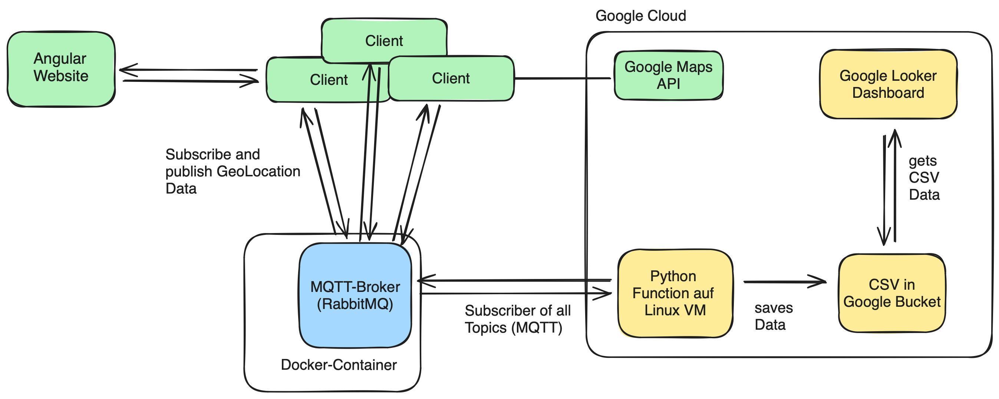

# mqtt_tracker
Repository for 5th semester DHBW-MOS School Project (MQTT-Server). \
Consisting of an MQTT client Angular website and a Python reporting tool. 

But whats the project about? With this application you can track your friends, whereever they are. \
The friends log into the website by their smartphones, which send their location data to a MQTT-Server. \
You can then see your friends location in a map. By providing a special topic, you can choose which friends you want to see. 

# Overview
A high-level overview of the project is this:

This repository contains the Angular Website and the Python Reporting Tool. Feel free to connect your own MQTT-Instance. 
The dashboard is an optional part of the project and not necessary to run the Main-Application. 

## Client-Webpage (Angular Website)
for details see [Client-Webpage](Client-Webpage/README.md)

## Reporting-Tool
for details see [Reporting-Tool](Reporting-Tool/README.md)

